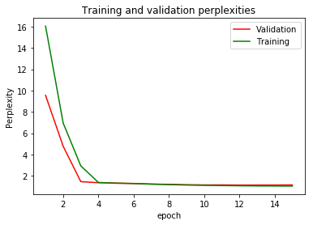

# Translating Image to LaTeX with Adaptive Attention

## Problem Statement 

* LaTeX has become the most popular typesetting system in both scientific and industrial fields with its ability to generate
beautiful mathematical equations
* However, once an equation is rendered, the output cannot be modified without
access to the underlying code, and it is very time consuming and error-prone for someone to re-type lengthy equations
by just looking at the image.

## Solution

* Based on [Genthial](https://guillaumegenthial.github.io/image-to-latex.html) and [Deng](http://lstm.seas.harvard.edu/latex/), our team implemented adaptive attention purposed by [Xu](https://github.com/jiasenlu/AdaptiveAttention) to further improve the network performance

## Results
* The training and validation perplexities of our model



* Model Performance

| Decoder      | EM(I)    | BLEU                 |ED (T)             |ED (I)         |
| -------------|----------| ---------------------|-------------------|---------------|
| [CNNEnc](http://lstm.seas.harvard.edu/latex/)|  0.53   | 0.75               | NR             | 0.61         | 
| [Greedy](https://guillaumegenthial.github.io/image-to-latex.html)         |  0.22   | 0.76                | 0.76             | 0.35         |
| [Beam](https://guillaumegenthial.github.io/image-to-latex.html)  |  0.32   | 0.78                | 0.76             | 0.62         |
| Our model       | **0.55**|**0.88**             |**0.91**          |**0.78**      |

**Result comparison of our model to the two models purposed
in [5] (One with beam search the other with greedy search).
EM stands for exact match, ED means edit distance, T and I are
text based and image based**

## Abstract 

LaTeX has become the most popular typesetting system in both scientific and industrial fields with its ability to generate
beautiful mathematical equations. However, once an equation is rendered, the output cannot be modified without
access to the underlying code, and it is very time consuming and error-prone for someone to re-type lengthy equations
by just looking at the image. To improve working efficiency, our team believes that it is worth studying to translate
mathematical equations directly from image to LaTeX code. As a sub-problem under image captioning, we decided to solve the problem with an encoder-decoder model
framework, started with the model structure proposed by [Genthial](https://guillaumegenthial.github.io/image-to-latex.html), and implemented adaptive attention mechanism
as our new approach. Thus, our model consists of a Convolutional Neural Network (CNN) encoder, a Long Short Term Memory (LSTM) decoder with adaptive attention
which knows for each time step whether it is worth looking at the image. Our model significantly outperformed the existing models with a BLEU score of 88% (13% increase)and
an image edit distance of 78% (25% increase).

[Project Report](https://github.com/Derolik666/Image_to_Latex/blob/master/Results/Project_Report.pdf) can be accessed here.

## Install

Install pdflatex (latex to pdf) and ghostsript + [magick](https://www.imagemagick.org/script/install-source.php
) (pdf to png) on Linux


```
make install-linux
```

(takes a while ~ 10 min, installs from source)

On Mac, assuming you already have a LaTeX distribution installed, you should have pdflatex and ghostscript installed, so you just need to install magick. You can try

```
make install-mac
```

## Getting Started

We provide a small dataset just to check the pipeline. To build the images, train the model and evaluate

```
make small
```

You should observe that the model starts to produce reasonable patterns of LaTeX after a few minutes.


## Data

We provide the pre-processed formulas from [Harvard](https://zenodo.org/record/56198#.V2p0KTXT6eA) but you'll need to produce the images from those formulas (a few hours on a laptop).

```
make build
```

Alternatively, you can download the [prebuilt dataset from Harvard](https://zenodo.org/record/56198#.V2p0KTXT6eA) and use their preprocessing scripts found [here](https://github.com/harvardnlp/im2markup)


## Training on the full dataset

If you already did `make build` you can just train and evaluate the model with the following commands

```
make train
make eval
```

Or, to build the images from the formulas, train the model and evaluate, run

```
make full
```


## Details

1. Build the images from the formulas, write the matching file and extract the vocabulary. __Run only once__ for a dataset
```
python build.py --data=configs/data.json --vocab=configs/vocab.json
```

2. Train
```
python train.py --data=configs/data.json --vocab=configs/vocab.json --training=configs/training.json --model=configs/model.json --output=results/full/
```

3. Evaluate the text metrics
```
python evaluate_txt.py --results=results/full/
```

4. Evaluate the image metrics
```
python evaluate_img.py --results=results/full/
```

(To get more information on the arguments, run)

```
python file.py --help
```
